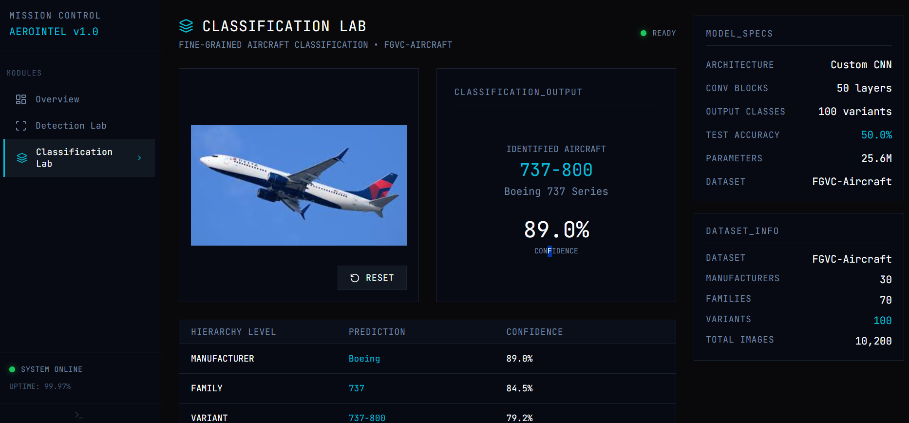
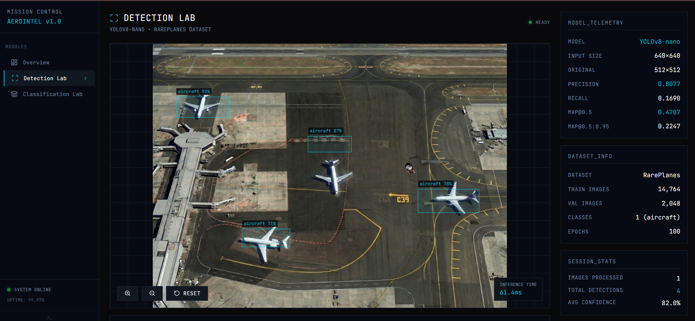

# AeroIntel: Intelligent Airport Managment System

**AEROINTEL v1.0** integrates the trained aircraft classification and detection model into a web application for aircraft analysis. The application consists of two main modules: the Aircraft Classification Module, designed for detailed aircraft identification, and the Aircraft Detection Module, focused on locating aircraft in aerial and satellite imagery.


The system is split into two interactive labs, each providing a dedicated interface for users to upload images, view model predictions, and explore results in real time.

### Classification Lab




### Detection Lab





## Tech Stack

### Backend


### Frontend


## Project Structure :

```
Airport_2/
├── README.md                          
│
├── models/                            # Pre-trained model weights
│   ├── classification/
│   │   └── resnet50.pth              # ResNet50 classification model
│   └── detection/
│       └── yolo8.pth                 # YOLOv8 detection model
│
├── notebooks/                         
│   ├── classification/
│   │   ├── 01_data_exploration.ipynb
│   │   ├── 02_model_training_ResNet.ipynb
│   │   └── 03_model_training_AeroNet.ipynb
│   └── detection/
│       ├── 01_data_exploration.ipynb
│       └── 02_model_training_YOLOv8.ipynb
│
└── src/
    ├── backend/                       # Flask REST API
    └── frontend/                      # React + TypeScript UI
```

## Model Training & Development

### Data Exploration
Start with the data exploration notebooks to understand the dataset:
- [Classification Data Exploration (FGVC Airccraft)](notebooks/classification/01_data_exploration.ipynb)
- [Detection Data Exploration (Rareplanes)](notebooks/detection/01_data_exploration.ipynb)

### Training Models
Train or fine-tune models using the provided notebooks:
- [ResNet Classification Training](notebooks/classification/02_model_training_ResNet.ipynb)
- [AeroNet Custom Architecture](notebooks/classification/03_model_training_AeroNet.ipynb)
- [YOLOv8 Detection Training](notebooks/detection/02_model_training_YOLOv8.ipynb)


## API Endpoints

### Detection & Classification
- `POST /detect` - Detect aircraft in image and classify them
- `POST /classify` - Classify a single aircraft image
- `GET /` - Health check endpoint

**Request Format:**
```json
{
  "image": "base64_encoded_image_data"
}
```

**Response Format:**
```json
{
  "detections": [
    {
      "class": "737-800",
      "confidence": 0.95,
      "bbox": [x, y, width, height]
    }
  ]
}
```


## Performance

| Model | Task | Accuracy | Speed |
|-------|------|----------|-------|
| ResNet50 | Classification | ~95% | ~50ms |
| YOLOv8n | Detection | ~92% mAP | ~35ms |

*Performance metrics measured on standard hardware. Results vary based on input image quality and aircraft size.*


